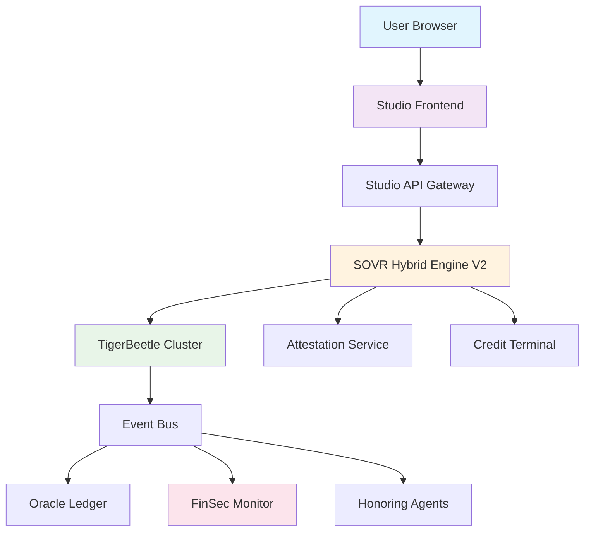
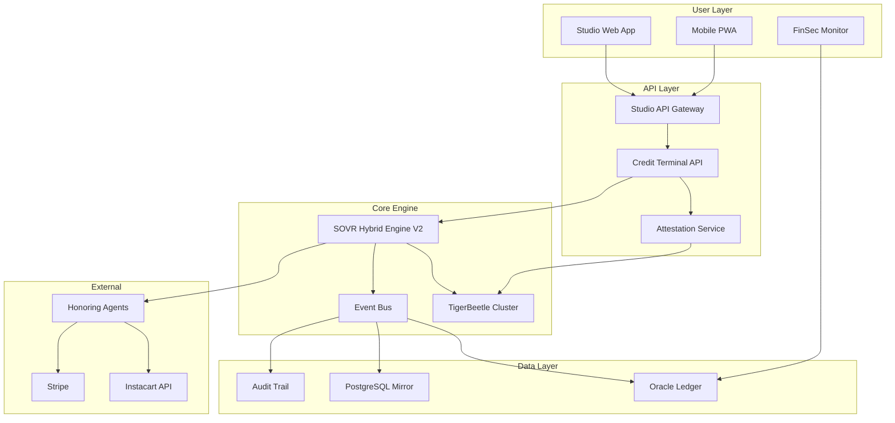

# SOVR Ecosystem Application Architecture Consultation

## Executive Summary

**SOVR is a ledger-cleared obligation network** that transforms how value is authorized, validated, and fulfilled without traditional payment processing. This consultation provides a complete architectural vision for the real-world application implementation.

**Key Principle**: Truth is mechanical, not narrative. If it did not clear in TigerBeetle, it did not happen.

---

## 1. Primary User Interface Layer Strategy

### **Recommended Architecture: Multi-Tiered UI Approach**

#### **Tier 1: Studio (USD Gateway Frontend) - Primary User Interface**
```
Studio ←→ SOVR Hybrid Engine V2 ←→ TigerBeetle (Truth)
```

**Why Studio as Primary UI:**
- **Existing Infrastructure**: Already built with Next.js, TypeScript, modern stack
- **Attestation Integration**: Designed for EIP-712 signed attestations
- **User Familiarity**: Stripe-like checkout experience reduces learning curve
- **Bridge Function**: Translates between USD settlement and obligation clearing

#### **Tier 2: FinSec Monitor (System Control Center)**
```
FinSec Monitor ←→ Oracle Ledger ←→ Event Bus ←→ All Systems
```

**FinSec as Operations Dashboard:**
- **Observer Role**: Monitors system health without authority
- **Audit Trail**: Real-time narrative mirroring of clearing events
- **Compliance Reporting**: Immutable audit logs and regulatory compliance
- **No Control Authority**: Observes only, never modifies reality

#### **Tier 3: Mobile-First Progressive Web App (PWA)**
```
PWA ←→ Studio API ←→ Credit Terminal ←→ TigerBeetle
```

**Mobile Application Purpose:**
- Individual user onboarding and credit management
- Essential goods purchasing (Three SKUs That Matter)
- Real-time obligation status and fulfillment tracking

---

## 2. Studio ↔ SOVR Hybrid Engine Integration

### **Integration Architecture**



### **Integration Flow**

#### **Phase 1: Intent Submission (Studio → Hybrid Engine)**
```typescript
// Studio calls Hybrid Engine
POST /api/obligations/intent
{
  "amount": 7.5, // Three SKUs bundle
  "userId": "user_123",
  "reference": "groceries_weekly",
  "attestation": "0xabc..." // EIP-712 signature
}

// Hybrid Engine validates and submits to TigerBeetle
```

#### **Phase 2: Attestation Validation**
```typescript
// Hybrid Engine checks attestation
interface AttestationCheck {
  validateSignature(signature: string): boolean;
  checkExpiry(attestation: Attestation): boolean;
  verifySigner(attestation: Attestation): boolean;
}

// If valid: proceed to clearing
// If invalid: reject with mechanical finality
```

#### **Phase 3: TigerBeetle Clearing**
```typescript
// Mechanical truth application
const clearingResult = await tigerBeetle.createTransfer({
  debit_account: USER_ACCOUNT,
  credit_account: SYSTEM_BUFFER,
  amount: 7.5,
  reference: "groceries_weekly",
  metadata: { attestation, userId, timestamp }
});

// Finality achieved - no reversals possible
```

#### **Phase 4: Event Propagation**
```typescript
// Event bus broadcasts clearing finality
{
  event: "OBLIGATION_CLEARED",
  transferId: "tb_123",
  amount: 7.5,
  timestamp: "2025-12-28T10:41:45Z",
  attestation: "0xabc...",
  finality: true
}
```

---

## 3. UX Patterns for Obligation Clearing vs Payment Processing

### **Core Mental Model Shift**

| Payment Processing | Obligation Clearing |
|-------------------|-------------------|
| "Pay for goods" | "Authorize outcome" |
| "Process transaction" | "Clear obligation" |
| "Settle balance" | "Record finality" |
| "Reverse if needed" | "New transfer required" |

### **User Experience Patterns**

#### **Pattern 1: Authorization-First UX**

```tsx
// Instead of "Pay Now" button
<Button onClick={authorizeObligation}>
  Authorize Groceries Delivery
  <Subtext>7.5 units • Instacart fulfillment</Subtext>
</Button>

// Status flow:
Loading → Authorized → Cleared → Fulfilled (Optional)
```

#### **Pattern 2: Attestation-Visible Interface**

```tsx
// Show attestation status clearly
<AttestationStatus>
  <StatusBadge variant="pending">Attestation Required</StatusBadge>
  <StatusBadge variant="valid">Legitimacy Verified</StatusBadge>
  <StatusBadge variant="cleared">Obligation Finalized</StatusBadge>
</AttestationStatus>
```

#### **Pattern 3: Honoring-Agent Choice**

```tsx
// Users choose honoring agents (optional)
<HonoringOptions>
  <Radio value="instacart">Instacart (Grocery Delivery)</Radio>
  <Radio value="giftcard">Gift Card (Self-Fulfillment)</Radio>
  <Radio value="skip">Skip Honoring (Record Only)</Radio>
</HonoringOptions>
```

#### **Pattern 4: Finality-Proof Display**

```tsx
// Clear finality messaging
<ClearingResult>
  <SuccessIcon>✓</SuccessIcon>
  <Title>Obligation Cleared</Title>
  <Details>
    Transfer ID: tb_123456789
    Finality: Mechanical (TigerBeetle)
    No Reversals Possible
  </Details>
  <NextStep>
    {honoringAgent ? "Honoring in progress..." : "Clearing complete"}
  </NextStep>
</ClearingResult>
```

---

## 4. Three SKUs That Matter - User Experience Design

### **Essential Goods Interface**

#### **Individual SKU Purchase**
```tsx
<EssentialGoodsPurchase>
  <SKUCard sku="MILK_WHOLE">
    <ProductImage src="/milk-bottle.png" />
    <ProductName>Whole Milk</ProductName>
    <Price>3.5 units</Price>
    <Description>Fat+protein liquid for metabolic continuity</Description>
    <AuthorizeButton variant="primary">
      Authorize Milk Delivery
    </AuthorizeButton>
  </SKUCard>
</EssentialGoodsPurchase>
```

#### **Bundle Purchase (Recommended)**
```tsx
<EssentialsBundle>
  <BundleTitle>Essential Survival Bundle</BundleTitle>
  <BundleContents>
    <BundleItem>Whole Milk (3.5 units)</BundleItem>
    <BundleItem>Chicken Eggs (2.5 units)</BundleItem>
    <BundleItem>White Bread (1.5 units)</BundleItem>
  </BundleContents>
  <BundleTotal>Total: 7.5 units</BundleTotal>
  <BundleCalories>~1,200 kcal sustained</BundleCalories>
  <AuthorizeBundleButton>
    Authorize Essentials Delivery
  </AuthorizeBundleButton>
</EssentialsBundle>
```

#### **Survival Status Dashboard**
```tsx
<SurvivalStatus>
  <StatusCard title="Milk Access">
    <Status>Available</Status>
    <LastDelivery>Today</LastDelivery>
    <NextAvailable>24h</NextAvailable>
  </StatusCard>
  
  <StatusCard title="Eggs Access">
    <Status>Available</Status>
    <Stock>Dozen in basket</Stock>
    <Expiry>2 weeks</Expiry>
  </StatusCard>
  
  <StatusCard title="Bread Access">
    <Status>Available</Status>
    <Stock>Loaf available</Stock>
    <ShelfLife>3 days</ShelfLife>
  </StatusCard>
  
  <SurvivalScore>
    <Score value={100}>Survival Capability: 100%</Score>
    <Warning>System can sustain life</Warning>
  </SurvivalScore>
</SurvivalStatus>
```

---

## 5. Primary Dashboard/Control Center Design

### **FinSec Monitor as System Control Center**

#### **Executive Dashboard Layout**

```tsx
<FinSecControlCenter>
  <Header>
    <Title>SOVR Ecosystem Control Center</Title>
    <StatusIndicators>
      <TigerBeetleStatus>🟢 Operational</TigerBeetleStatus>
      <HybridEngineStatus>🟢 Clearings Active</HybridEngineStatus>
      <AttestationStatus>🟢 Validating</AttestationStatus>
    </StatusIndicators>
  </Header>
  
  <MainGrid>
    <ClearingMetrics>
      <Metric title="Today's Clearings" value="1,247" />
      <Metric title="Obligations Cleared" value="98.7%" />
      <Metric title="Average Clearing Time" value="23ms" />
    </ClearingMetrics>
    
    <SurvivalStatus>
      <SKUMetrics>
        <SKUStatus sku="MILK" deliveryRate="96%" />
        <SKUStatus sku="EGGS" deliveryRate="94%" />
        <SKUStatus sku="BREAD" deliveryRate="97%" />
      </SKUMetrics>
    </SurvivalStatus>
    
    <SystemHealth>
      <ClusterHealth nodes={5} healthy={5} />
      <AttestationQueue pending={23} />
      <EventBusLatency avg="12ms" />
    </SystemHealth>
    
    <AuditTrail>
      <RecentClearings limit={10} />
      <AttestationLog limit={10} />
      <HonoringAttempts limit={10} />
    </AuditTrail>
  </MainGrid>
</FinSecControlCenter>
```

#### **Operational Procedures Interface**

```tsx
<OperationalProcedures>
  <DailyChecks>
    <CheckItem>TigerBeetle cluster health verification</CheckItem>
    <CheckItem>Transfer finality confirmation</CheckItem>
    <CheckItem>No pending obligations review</CheckItem>
    <CheckItem>Attestation system availability</CheckItem>
  </DailyChecks>
  
  <IncidentResponse>
    <Trigger>Clearing Failure Detected</Trigger>
    <Actions>
      <Action>Verify cluster health</Action>
      <Action>Check network connectivity</Action>
      <Action>Restart failed nodes</Action>
      <Action>⚠️ NEVER override clearing</Action>
    </Actions>
  </IncidentResponse>
</OperationalProcedures>
```

#### **Compliance Reporting**

```tsx
<ComplianceCenter>
  <AuditExports>
    <ExportButton format="PDF">Monthly Compliance Report</ExportButton>
    <ExportButton format="CSV">Clearing Audit Trail</ExportButton>
    <ExportButton format="JSON">Attestation Records</ExportButton>
  </AuditExports>
  
  <RegulatoryDashboards>
    <Dashboard title="No Custodial Risk">
      <Metric>Zero "user funds" detected</Metric>
      <Metric>No shared pools identified</Metric>
      <Metric>All value = cleared obligations</Metric>
    </Dashboard>
    
    <Dashboard title="No Central Control">
      <Metric>No single entity can freeze funds</Metric>
      <Metric>No reversals possible</Metric>
      <Metric>No narrative authority detected</Metric>
    </Dashboard>
  </RegulatoryDashboards>
</ComplianceCenter>
```

---

## 6. Core Application Integration Strategy

### **Application Integration Map**



### **Integration Principles**

#### **1. Studio ↔ Hybrid Engine**
- **Protocol**: RESTful API with WebSocket for real-time updates
- **Authentication**: EIP-712 attestation-based
- **Data Flow**: Intent → Attestation → Clearing → Event propagation

#### **2. Hybrid Engine ↔ TigerBeetle**
- **Protocol**: Direct TigerBeetle client connection
- **Authority**: Hybrid Engine submits, TigerBeetle decides
- **Finality**: Mechanical truth, no overrides

#### **3. FinSec ↔ Oracle Ledger**
- **Protocol**: Read-only PostgreSQL connection
- **Authority**: Observer only, never authoritative
- **Purpose**: Narrative mirroring, audit trail, compliance reporting

#### **4. Event Bus ↔ All Components**
- **Protocol**: WebSocket event streaming
- **Purpose**: Real-time propagation of clearing events
- **Constraints**: Read-only, cannot modify transfers

---

## 7. Real-World Use Case Implementations

### **Use Case 1: Individual Account Setup and Credit Receipt**

#### **User Journey**
```mermaid
sequenceDiagram
    participant U as User
    participant S as Studio
    participant H as Hybrid Engine
    participant A as Attestor
    participant T as TigerBeetle
    participant O as Oracle Ledger
    
    U->>S: Create Account
    S->>H: Submit Account Creation Intent
    H->>A: Validate Identity Attestation
    A->>H: Return Att->>T: Create Account Transfer
    Testation
    H->>H: Account Created (Final)
    H->>S: Success Response
    S->>U: Account Active
    T->>O: Log Account Creation
```

#### **Implementation**
```typescript
// Account Creation Flow
const createAccount = async (userData: UserData) => {
  // Step 1: Intent submission
  const intent = await studioAPI.submitIntent({
    type: "ACCOUNT_CREATION",
    userData,
    attestation: await attestUserIdentity(userData)
  });
  
  // Step 2: Hybrid Engine processes
  const account = await hybridEngine.createAccount(intent);
  
  // Step 3: TigerBeetle finalizes
  const transfer = await tigerBeetle.createTransfer({
    debit_account: SYSTEM_RESERVE,
    credit_account: USER_ACCOUNT,
    amount: INITIAL_CREDIT,
    reference: `account_${userData.id}`,
    metadata: { attestation: intent.attestation }
  });
  
  return {
    accountId: account.id,
    transferId: transfer.id,
    finality: true,
    initialCredit: INITIAL_CREDIT
  };
};
```

### **Use Case 2: Essential Goods Purchase (Three SKUs)**

#### **User Interface Flow**
```tsx
const EssentialGoodsFlow = () => {
  const [selectedItems, setSelectedItems] = useState([]);
  const [authorization, setAuthorization] = useState(null);
  
  const authorizePurchase = async () => {
    // Step 1: Bundle calculation
    const totalAmount = selectedItems.reduce((sum, item) => 
      sum + item.price, 0
    );
    
    // Step 2: Attestation request
    const attestation = await requestAttestation({
      amount: totalAmount,
      items: selectedItems,
      userId: currentUser.id
    });
    
    // Step 3: Submit to Hybrid Engine
    const clearing = await hybridEngine.clearObligation({
      amount: totalAmount,
      reference: "essentials_purchase",
      attestation,
      honoringAgent: "instacart"
    });
    
    // Step 4: Display finality
    setAuthorization({
      status: "CLEARED",
      transferId: clearing.transferId,
      finality: true,
      honoringInProgress: true
    });
  };
  
  return (
    <div>
      <SKUSelector onSelectionChange={setSelectedItems} />
      <AuthorizationButton 
        onClick={authorizePurchase}
        disabled={selectedItems.length === 0}
      >
        Authorize {totalAmount} Units Delivery
      </AuthorizationButton>
      {authorization && (
        <ClearingResult result={authorization} />
      )}
    </div>
  );
};
```

### **Use Case 3: Utility Payment Through Anchor Honoring**

#### **Implementation Pattern**
```typescript
interface UtilityPaymentObligation {
  utilityType: "electricity" | "water" | "gas";
  accountNumber: string;
  amount: number;
  dueDate: Date;
  attestation: Attestation;
}

const processUtilityPayment = async (payment: UtilityPaymentObligation) => {
  // Step 1: Validate utility account
  const accountValid = await validateUtilityAccount(
    payment.utilityType, 
    payment.accountNumber
  );
  
  if (!accountValid) {
    throw new Error("Invalid utility account");
  }
  
  // Step 2: Clear obligation
  const clearing = await hybridEngine.clearObligation({
    amount: payment.amount,
    reference: `utility_${payment.utilityType}_${payment.accountNumber}`,
    metadata: {
      utilityType: payment.utilityType,
      accountNumber: payment.accountNumber,
      dueDate: payment.dueDate
    },
    attestation: payment.attestation,
    honoringAgent: "utility_provider"
  });
  
  // Step 3: Trigger honoring (external)
  const honoring = await utilityHonoringAgent.processPayment({
    transferId: clearing.transferId,
    utilityDetails: payment
  });
  
  return {
    obligationCleared: true,
    transferId: clearing.transferId,
    honoringAttempted: true,
    externalReference: honoring.reference
  };
};
```

### **Use Case 4: Credit Terminal Operations**

#### **Credit Terminal Interface**
```tsx
const CreditTerminal = () => {
  const [currentState, setCurrentState] = useState("IDLE");
  const [pendingObligations, setPendingObligations] = useState([]);
  
  const processIntent = async (intent: Intent) => {
    try {
      // Step 1: Validate attestation
      setCurrentState("VALIDATING");
      const attestationValid = await validateAttestation(intent.attestation);
      
      if (!attestationValid) {
        setCurrentState("REJECTED");
        return { status: "REJECTED", reason: "Invalid attestation" };
      }
      
      // Step 2: Submit to TigerBeetle
      setCurrentState("CLEARING");
      const transfer = await tigerBeetle.createTransfer({
        debit_account: intent.debitAccount,
        credit_account: intent.creditAccount,
        amount: intent.amount,
        reference: intent.reference,
        metadata: { 
          attestation: intent.attestation,
          timestamp: Date.now(),
          terminalId: "CT_001"
        }
      });
      
      // Step 3: Broadcast completion
      setCurrentState("COMPLETED");
      await eventBus.broadcast({
        type: "OBLIGATION_CLEARED",
        transferId: transfer.id,
        finality: true
      });
      
      return {
        status: "CLEARED",
        transferId: transfer.id,
        finality: true
      };
      
    } catch (error) {
      setCurrentState("ERROR");
      throw error;
    }
  };
  
  return (
    <TerminalInterface>
      <StateDisplay>{currentState}</StateDisplay>
      <ProcessingQueue pending={pendingObligations.length} />
      <ClearingMetrics 
        totalProcessed={metrics.total}
        successRate={metrics.successRate}
      />
    </TerminalInterface>
  );
};
```

---

## 8. Implementation Roadmap

### **Phase 1: Core Infrastructure (Weeks 1-2)**

#### **TigerBeetle Deployment**
- [ ] Deploy 5-node TigerBeetle cluster
- [ ] Configure account namespace (27 accounts from Oracle Ledger)
- [ ] Implement clearing API endpoints
- [ ] Test mechanical finality

#### **Studio API Enhancement**
- [ ] Extend Studio API for obligation submission
- [ ] Implement EIP-712 attestation validation
- [ ] Add real-time WebSocket connections
- [ ] Create obligation clearing UI components

### **Phase 2: Hybrid Engine Integration (Weeks 3-4)**

#### **Credit Terminal Development**
- [ ] Deploy SOVR Hybrid Engine V2 backend
- [ ] Implement attestation-first validation
- [ ] Create TigerBeetle integration layer
- [ ] Build honoring agent interface

#### **Event Bus Implementation**
- [ ] Deploy real-time event streaming
- [ ] Connect all system components
- [ ] Implement audit trail logging
- [ ] Create monitoring dashboards

### **Phase 3: User Experience (Weeks 5-6)**

#### **Three SKUs Interface**
- [ ] Build essential goods purchasing UI
- [ ] Implement survival bundle logic
- [ ] Create Instacart integration
- [ ] Add real-time delivery tracking

#### **FinSec Monitor Enhancement**
- [ ] Extend FinSec for obligation monitoring
- [ ] Create compliance reporting tools
- [ ] Implement audit trail visualization
- [ ] Add operational procedure guides

### **Phase 4: Production Deployment (Weeks 7-8)**

#### **External Integrations**
- [ ] Deploy honoring agents (Instacart, Stripe, ACH)
- [ ] Implement utility payment adapters
- [ ] Create gift card activation system
- [ ] Test end-to-end fulfillment flows

#### **Security and Compliance**
- [ ] Complete security audits
- [ ] Implement semantic freeze enforcement
- [ ] Create regulatory compliance reports
- [ ] Test system isolation and survival

---

## 9. Key Architectural Decisions

### **Decision 1: Studio as Primary UI**
**Rationale**: 
- Existing infrastructure and user familiarity
- Bridge between USD settlement and obligation clearing
- Attestation-first design aligns with SOVR principles

### **Decision 2: FinSec as Observer-Only Dashboard**
**Rationale**:
- Enforces "admins observe, don't correct" doctrine
- Provides compliance and audit capabilities
- Maintains mechanical truth integrity

### **Decision 3: Event-Driven Architecture**
**Rationale**:
- Enables real-time propagation of clearing events
- Supports multiple honoring agents
- Maintains loose coupling between components

### **Decision 4: Mobile-First Essential Goods**
**Rationale**:
- Survival testing requires immediate access
- Mobile-first design for essential needs
- PWA enables offline capability

---

## 10. Success Metrics and Validation

### **System Survival Metrics**
- **Milk Delivery Rate**: ≥80% of milk orders fulfilled
- **Eggs Delivery Rate**: ≥80% of eggs orders fulfilled  
- **Bread Delivery Rate**: ≥80% of bread orders fulfilled
- **Bundle Delivery Rate**: ≥80% of essential bundles fulfilled

### **Technical Performance Metrics**
- **Clearing Latency**: <50ms average
- **System Uptime**: 99.9% availability
- **Attestation Validation**: <100ms response time
- **Event Propagation**: <10ms to all observers

### **Compliance Validation**
- **No Custodial Risk**: Zero "user funds" detected
- **No Central Control**: No single point of failure
- **Mechanical Truth**: All transfers final in TigerBeetle
- **Semantic Compliance**: Zero blacklist violations

---

## 11. Risk Mitigation Strategies

### **Risk 1: Honoring Agent Refusal**
**Mitigation**: 
- Multiple honoring agents per use case
- Clear messaging about optional honoring
- System continues functioning without honoring

### **Risk 2: Attestation System Failure**
**Mitigation**:
- Multiple attestor redundancy
- Fallback attestation modes
- Clear rejection for invalid attestations

### **Risk 3: User Confusion About Obligations vs Payments**
**Mitigation**:
- Clear UX patterns and terminology
- Educational content about SOVR principles
- Attestation-first workflow design

### **Risk 4: Regulatory Misclassification**
**Mitigation**:
- Strict adherence to SOVR doctrine
- Clear "no custody" documentation
- Observer-only operational model

---

## Conclusion

The SOVR ecosystem represents a fundamental shift from payment processing to obligation clearing. This architecture provides:

1. **Studio** as the primary user interface bridging USD and obligation clearing
2. **FinSec Monitor** as the observer-only control center
3. **Clear UX patterns** that distinguish obligations from payments
4. **Survival-focused design** around the Three SKUs That Matter
5. **Mechanical truth enforcement** through TigerBeetle
6. **Compliance-first approach** with full audit trails

The system survives because it refuses control, maintains mechanical truth, and provides optional honoring rather than guaranteed fulfillment.

**This is not fintech. This is clearing reality itself.**