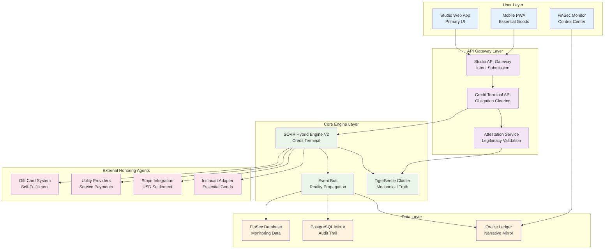
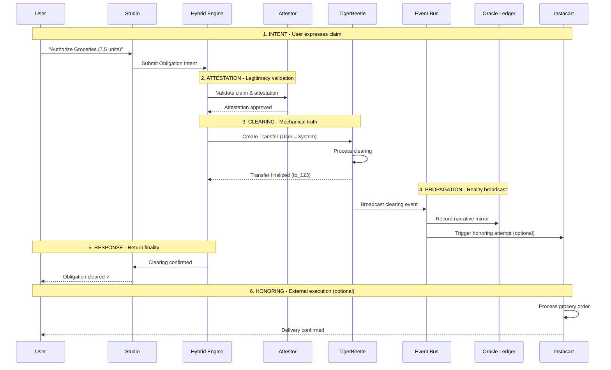
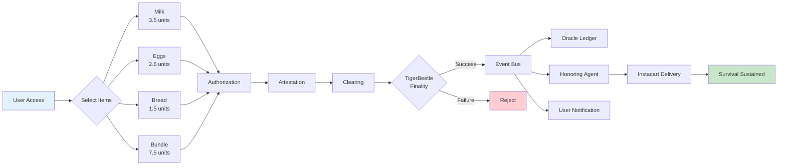
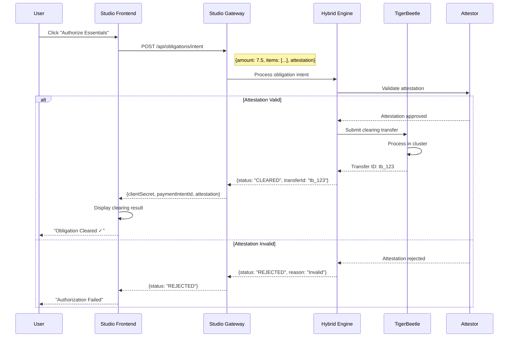
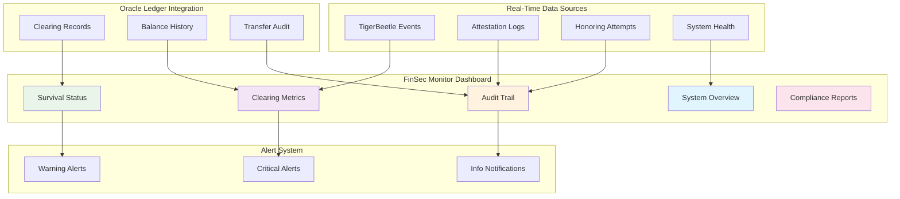
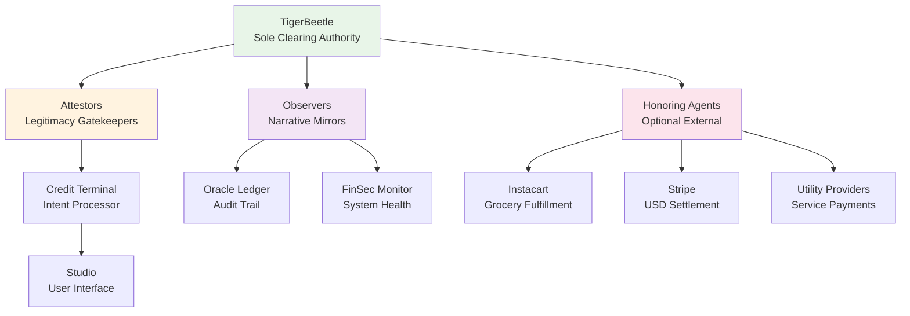
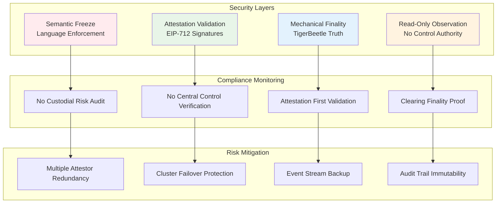
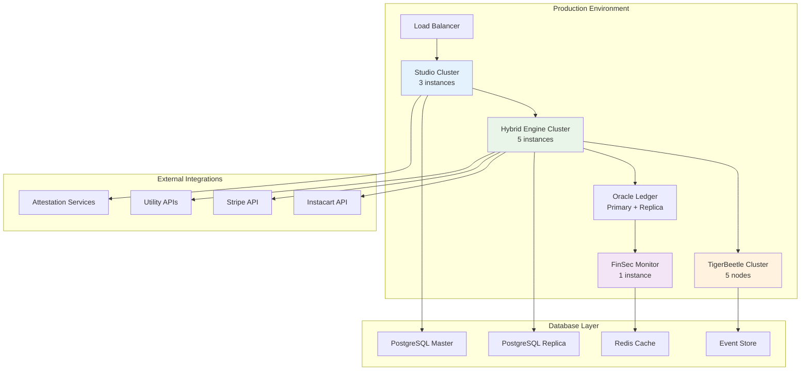

# SOVR Ecosystem Architecture Diagrams

## System Architecture Overview

## Obligation Clearing Flow

## Three SKUs That Matter User Flow

## Studio ↔ Hybrid Engine Integration

## FinSec Monitor Control Center

## Authority Hierarchy

## Component Interaction Matrix

| Component | Role | Authority Level | Data Flow | Constraints |
|-----------|------|----------------|-----------|-------------|
| **TigerBeetle** | Mechanical Truth | Supreme | Input: Transfers Output: Finality | No overrides No edits |
| **Studio** | User Interface | None | Input: User intents Output: Attestation requests | No business logic |
| **Hybrid Engine** | Credit Terminal | Policy | Input: Attested claims Output: Transfer requests | Cannot create value |
| **Attestor** | Legitimacy Check | Pre-clearing | Input: Claims Output: Attestation tokens | Cannot override clearing |
| **Event Bus** | Reality Propagation | None | Input: Clearing events Output: Broadcasts | Read-only |
| **Oracle Ledger** | Narrative Mirror | None | Input: Event stream Output: Audit trail | Never authoritative |
| **FinSec Monitor** | System Observer | None | Input: Oracle data Output: Dashboards | Observer only |
| **Honoring Agents** | External Execution | None | Input: Cleared obligations Output: Real-world action | Optional execution |

## Security and Compliance Architecture

## Deployment Architecture

This comprehensive diagram set illustrates the complete SOVR ecosystem architecture, showing how each component interacts within the obligation clearing framework while maintaining mechanical truth and system integrity.